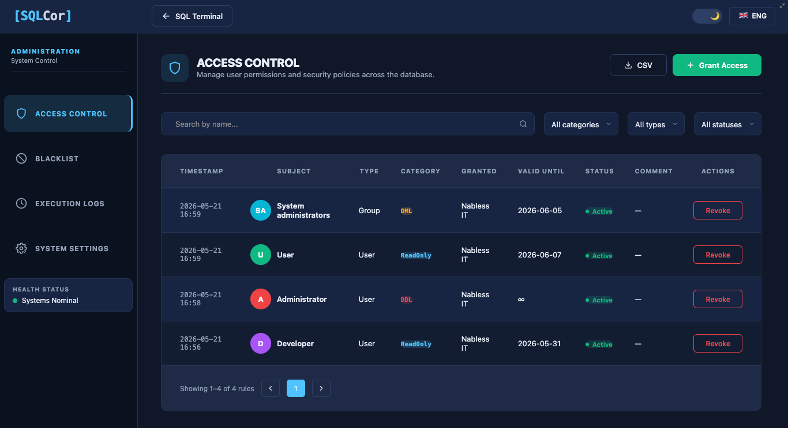
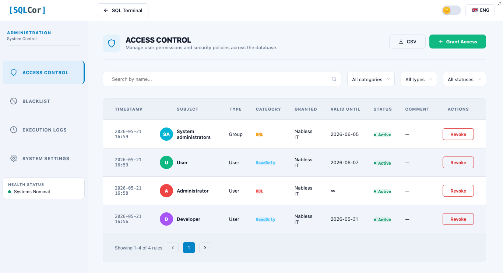
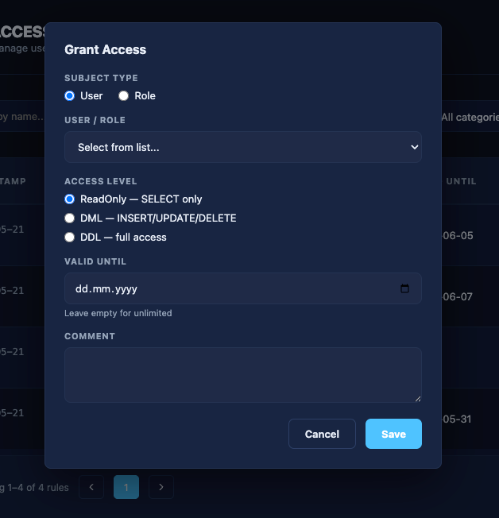
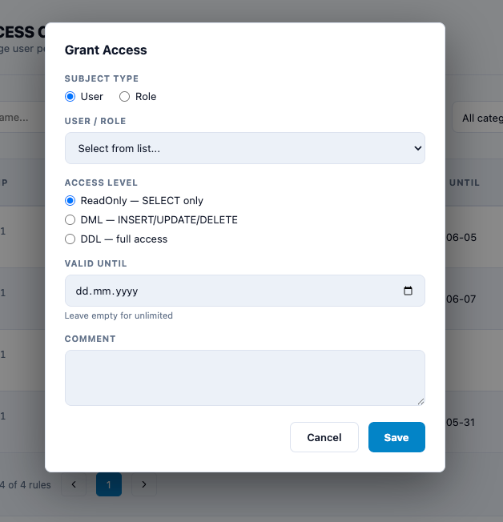
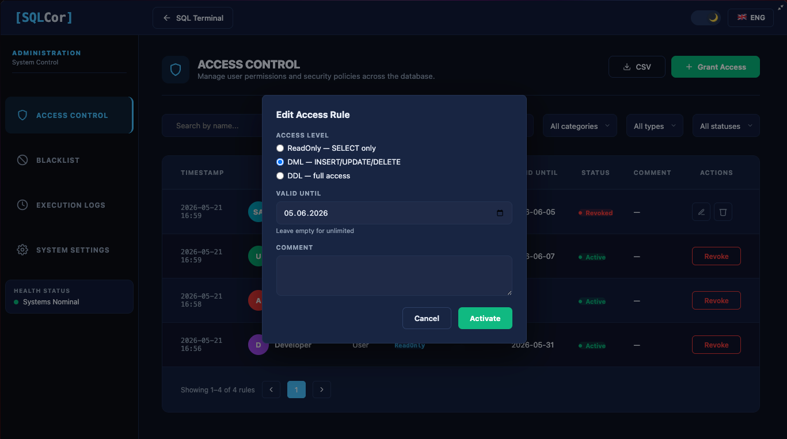
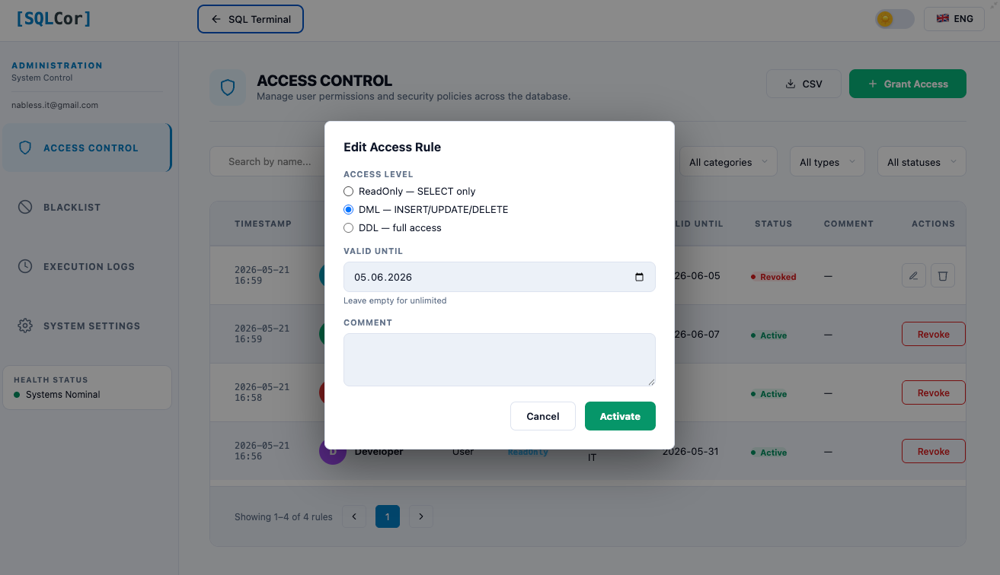

> Complete reference for SQL Cor administrators: access control, blacklist management, system settings, execution logs, and maintenance mode.

---

## Who this guide is for

This guide is for users in the Creatio **System Administrators** role who:
- Manage who can use SQL Cor and at what level
- Configure blacklist rules to block dangerous operations
- Monitor query activity through the audit log
- Tune system settings (limits, timeouts, retention)
- Enable maintenance mode during planned downtime

If you are a regular user running queries, see [User Guide](/v1.0/user-guide/) instead.
If you are installing SQL Cor for the first time, start with [Installation](/v1.0/installation/).

---

## Opening the Administration panel

The Administration panel is accessible only to Creatio System Administrators.

**How to open:**
1. From the SQL Terminal page, click the **⚙️ Administration** button in the top-right header
2. The page switches to the Administration panel — your Terminal query is preserved

**How to return:**
1. Click **SQL Terminal** link in the top-left of the header
2. The page switches back — your query is still in the editor

> [!note] Soft Navigation
> Switching between Terminal and Administration does not reload the page. Your editor content is preserved throughout the session.


---

## Administration page layout

The Administration page has three regions:


**Sidebar navigation:**
Clicking a sidebar item switches the main content area without reloading.
The active item is highlighted with a colored accent bar.

---

## Tab 1 — Access Control ^access-control

This tab manages **who can use SQL Cor** and **what operations they can perform**.




### Statistics cards (top of tab)

Three cards show a live summary:

| Card | Shows |
|------|-------|
| **Active rules** | Count of currently active access rules |
| **Users** | Count of individual users with access |
| **Roles** | Count of roles with access |

---

### Filters

| Filter | Options | Purpose |
|--------|---------|---------|
| **Search** | Free text | Filter by subject name or email |
| **Category** | ReadOnly / DML / DDL | Filter by access level |
| **Type** | User / Group (Role) | Filter by subject type |
| **Status** | Active / Revoked | Filter by rule status |

Filters combine — applying multiple narrows results further.
Clearing all filters shows all rules.

---

### Access rules table

Each row represents one access rule.

| Column | What it shows |
|--------|---------------|
| **Subject** | Avatar + Name + Email of the user or role |
| **Type** | User or Group (Role) |
| **Category** | Access level: ReadOnly / DML / DDL |
| **Status** | Active (green) or Revoked (gray strikethrough) |
| **Valid Until** | Expiration date, or "—" if permanent |
| **Actions** | Context-dependent buttons (see below) |

---

### Action buttons per rule

**For Active rules:**

| Button | Name | What it does |
|--------|------|--------------|
| 🚫 | **Revoke** | Deactivates the rule — changes Status to Revoked. Rule stays in the table for audit history. User loses access immediately. |
| 🗑️ | **Delete** | Permanently removes the record from the database. Cannot be undone. Use when you want no trace. |

**For Revoked rules:**

| Button | Name | What it does |
|--------|------|--------------|
| ✏️ | **Edit** | Opens the rule dialog pre-filled. Lets you change Valid Until date, access category. Has an **Activate** button to re-enable the rule. |
| 🗑️ | **Delete** | Permanently removes the revoked record. |

> [!tip] Revoke vs Delete
> **Revoke** preserves audit history — you can see who had access when, and restore if needed.
> **Delete** removes permanently — use only when the rule was added by mistake or must be purged (e.g. GDPR).

---

### Grant Access dialog ^grant-access

Click **+ Grant Access** (top-right of the table) to open this dialog.




#### Field: Subject type (radio buttons)

| Option | Effect |
|--------|--------|
| **User** | Access granted to one specific person |
| **Role** | Access granted to all current and future members of the role |

> [!tip] Use Roles for Teams
> Granting to a Role is easier to maintain. When someone joins or leaves the team, their SQL Cor access follows automatically without you changing anything.

#### Field: User / Role dropdown

- **Dynamically loads** based on the Subject type selection
- Search by typing a name
- For Users: shows name + email
- For Roles: shows role name

#### Field: Access Level (radio buttons)

| Level | Code | Allowed operations |
|-------|------|--------------------|
| **ReadOnly** | 10 | `SELECT` only. Auto-LIMIT injected. Multi-statement queries blocked. |
| **DML** | 20 | `SELECT`, `INSERT`, `UPDATE`, `DELETE` |
| **DDL** | 30 | All DML plus `CREATE`, `ALTER`, `DROP` on non-system tables |

> [!warning] Start with ReadOnly
> Grant the minimum necessary level. You can always upgrade later. DDL in the wrong hands can alter the database structure.

#### Field: Valid Until (date picker)

| Value | Meaning |
|-------|---------|
| **Empty (blank)** | Permanent access — no expiration |
| **Date selected** | Access automatically deactivates after midnight on this date. Rule stays visible as Revoked. |

> [!tip] Use Valid Until for Contractors
> Set an expiration for temporary staff, auditors, or project-based access. Reduces the risk of "forgotten" access lingering after someone leaves.

#### Field: Comment (text input, optional)

Free text explaining why this access was granted.

**Examples:**
- `"Q4 financial audit — temp ReadOnly until Dec 31"`
- `"Senior DBA — permanent DML for data maintenance"`
- `"Migration project — DDL access for 2 weeks"`

> [!tip] Always Write a Comment
> Future you (or your successor) will thank you. The comment appears in the audit trail and makes access reviews much faster.

#### Dialog buttons

| Button | Action |
|--------|--------|
| **Save** | Creates the rule. User/role gains access immediately. Row appears in the table. |
| **Cancel** | Closes dialog without saving. No changes made. |

**Validation rules:**
- Subject (User or Role) is required
- Access Level is required
- Cannot create a duplicate active rule for the same subject at the same level

---

### Edit rule dialog (Revoked rules only)

Opened via ✏️ Edit on a Revoked rule.

Same fields as Grant Access, but pre-filled. Additional button:

| Button | Action |
|--------|--------|
| **Activate** | Re-enables the rule (sets Status back to Active). Same as creating a new rule for this subject. |
| **Save** | Saves changes to Valid Until / Category without activating |
| **Cancel** | Closes without changes |




---

### Confirm dialogs for destructive actions

> [!warning] These dialogs require explicit confirmation

**Revoking a rule:**
> *"Revoke this access? The user will lose access immediately. The rule will remain visible as revoked."*
> Buttons: **Revoke** / **Cancel**

**Deleting a rule:**
> *"Delete this access rule permanently? This cannot be undone."*
> Buttons: **Delete** / **Cancel**

---

## Tab 2 — Blacklist ^blacklist

This tab manages **patterns that are always blocked**, regardless of who tries to run them or their access level.

> [Screenshot: Blacklist tab — statistics cards, table with lock icons on system rules, Add Rule button]

### Statistics cards (top of tab)

| Card | Icon | Shows |
|------|------|-------|
| **System limits** | 🔒 Cube | Count of built-in (hardcoded) rules that cannot be changed |
| **Manual rules** | 👤 User | Count of rules you have added |
| **Total** | 📊 Layers | Total of all active blacklist entries |

---

### Blacklist table

| Column | What it shows |
|--------|---------------|
| **Icon** | Object type icon (table, field, or keyword) |
| **Name** | Pattern name or value |
| **Source** | **System** (built-in, locked 🔒) or **Manual** (admin-created) |
| **Type** | Table / Field / Keyword |
| **Reason** | Description shown to users when their query is blocked |
| **Actions** | Edit / Delete (System rules have no action buttons) |

> [!note] System Rules Are Locked
> Rules marked **System** with a 🔒 lock icon are hardcoded in the backend. They cannot be edited, disabled, or deleted by any administrator. This protects against accidental or malicious removal of critical safety rules.

**Examples of built-in System rules:**

| Pattern | Type | Reason |
|---------|------|--------|
| `xp_cmdshell` | Keyword | SQL Server shell — never allowed |
| `pg_read_file` | Keyword | Server filesystem access |
| `pg_sleep` | Keyword | Intentional DB blocking |
| `pg_terminate_backend` | Keyword | Killing database connections |
| `OPENROWSET` | Keyword | External data source access |
| `DROP DATABASE` | Keyword | Catastrophic data loss |
| `DnSql*` tables | Table | SQL Cor's own configuration tables |

---

### Add Rule dialog ^add-rule

Click **+ Add Rule** (top-right of the table) to open this dialog.

> [Screenshot: Add Rule dialog — all fields visible and labeled]

#### Field: Record type (radio buttons)

| Option | Use when you want to block |
|--------|---------------------------|
| **Table** | Access to an entire table (any query touching it) |
| **Field** | A specific column in a specific table |
| **Keyword** | A SQL keyword or function name |

#### Field: Value (text input)

The specific name to block.

| Type | Example value | Effect |
|------|--------------|--------|
| Table | `SysUser` | Blocks any query that references the `SysUser` table |
| Field | `Account.SecretKey` | Blocks access to the `SecretKey` column in `Account` |
| Keyword | `DROP` | Blocks any query containing the word `DROP` |

> [!warning] Keyword Rules Are Broad
> Blocking a keyword like `DELETE` will block ALL delete operations for everyone, including admins. Be precise — block specific tables or specific dangerous keywords, not common SQL verbs.

#### Field: Description (text input)

Explanation shown to users when their query is blocked.

**Write it as a helpful message, not just "blocked":**
- ❌ `"Blocked"`
- ✅ `"Direct access to SysUser is restricted. Use User Management in Creatio instead."`
- ✅ `"Schema changes require a change request. Contact DBA team."`

This text appears directly in the error message the user sees.

#### Dialog buttons

| Button | Action |
|--------|--------|
| **Save** | Creates the rule. Active immediately. |
| **Cancel** | Closes without saving. |

---

### Delete blacklist rule confirm dialog

**Deleting a manual rule:**
> *"Delete this blacklist rule? Queries matching this pattern will no longer be blocked."*
> Buttons: **Delete** / **Cancel**

> [!danger] Cannot Delete System Rules
> System rules (🔒) have no Delete button. They are permanent by design.

---

## Tab 3 — Execution Logs ^execution-logs

This tab provides a **complete audit trail** of every SQL query executed through SQL Cor.

> [Screenshot: Execution Logs tab — filters, quick presets, table with status indicators]

### Why the audit log matters

- **Incident investigation:** "Who deleted these records and when?"
- **Security review:** Spot unusual patterns or unexpected access
- **Compliance:** Evidence that access is controlled and audited
- **User coaching:** Identify users who could benefit from SQL training

> [!note] Logs Cannot Be Tampered With
> Individual log entries cannot be edited or deleted by administrators (except via the bulk "Clear Logs" action in System Settings). This preserves audit integrity.

---

### Filters

> [Screenshot: Filter controls expanded — search, date range, quick presets]

#### Search

Free text search across:
- Query text content
- Username
- Status text

#### Date range

| Field | Purpose |
|-------|---------|
| **From** | Start of the time window |
| **To** | End of the time window |

#### Quick presets (one-click date ranges)

| Preset | Sets range to |
|--------|--------------|
| **Day** | Last 24 hours |
| **Week** | Last 7 days |
| **Month** | Last 30 days |

Default view: last 7 days.

---

### Execution logs table

Paginated at **50 records per page** with full server-side pagination controls.

| Column | What it shows |
|--------|---------------|
| **Time** | Timestamp of execution (your local timezone) |
| **User** | Creatio username who ran the query |
| **Query** | Truncated query text (first ~60 chars) |
| **Duration** | Execution time in milliseconds |
| **Rows** | Rows returned (SELECT) or affected (DML/DDL) |
| **Status** | Success 🟢 / Error 🔴 / Syntax ⚠️ |

**Status values:**

| Status | Icon | Meaning |
|--------|------|---------|
| **Success** | 🟢 | Query executed and completed without errors |
| **Error** | 🔴 | Query failed with a database or system error |
| **Syntax** | ⚠️ | Query was rejected before execution due to syntax or parser error |

---

### Query Detail popup

Click any row in the table to open the **Query Detail** popup.

> [Screenshot: Query Detail popup — metadata, error text in red, full query with syntax highlighting]

**The popup shows:**

| Section | Contents |
|---------|---------|
| **Metadata** | User, timestamp, duration, row count, status |
| **Error text** | If status is Error — error message displayed in **red** |
| **Full query** | Complete query text with syntax highlighting |
| **Copy button** | Copies the full query text to clipboard |

> [!tip] Reuse Queries from Logs
> Click any log entry, copy the full query, and paste it into the Terminal editor. Useful for replicating an investigation or re-running a known-good query.

---

## Tab 4 — System Settings ^system-settings

This tab controls **global SQL Cor behavior** — limits, timeouts, retention, feature flags, and maintenance mode.

> [Screenshot: System Settings tab — System Info block, sliders, toggles, maintenance mode, service actions]

### System Information block (top of tab)

A read-only information panel showing live system state:

| Field | Shows |
|-------|-------|
| **Package version** | Installed SQL Cor version number |
| **DBMS** | Database engine (PostgreSQL or MSSQL) |
| **Active rules** | Count of currently active access rules |
| **DB ping latency** | Round-trip time to the database in ms |

---

### Query execution sliders

Three sliders control execution behavior. Changes apply immediately — no save button needed.

#### Query Timeout (seconds)

**Setting key:** `DnSqlDefaultTimeout`
**Range:** 5s — 300s
**Default:** 30s

How long the database waits before forcibly killing a running query.

| Value | When to use |
|-------|-------------|
| **5–30s** | Production — keeps resources free, catches runaway queries fast |
| **60–120s** | Staging / complex analytics |
| **120–300s** | Development / known long-running migrations |

> [!warning] High Timeout Risk
> A 300s timeout means a stuck query ties up a database connection for 5 minutes. Keep production timeouts conservative.

#### Log Retention (days)

**Setting key:** `DnSqlLogRetentionDays`
**Range:** 0 — 365 days
**Default:** 90 days

How many days of audit logs are kept. Older logs are automatically deleted by a nightly cleanup job.

| Value | When to use |
|-------|-------------|
| **0** | No retention — logs deleted immediately (not recommended) |
| **30** | Low-storage environments |
| **90** | Standard |
| **365** | Compliance or regulatory requirements |

> [!warning] Increase Before Audits
> If you know a compliance audit is coming, increase retention at least 30 days before the audit period starts — or older logs may already be purged.

#### Max Rows in result (rows)

**Setting key:** `DnSqlMaxRowLimit`
**Range:** 100 — 10,000 rows
**Default:** 1,000

Maximum rows returned by a single SELECT query. If a query produces more, results are truncated and a notice is shown to the user.

SQL Cor also **automatically injects** a LIMIT clause into SELECT queries that don't have one:
- PostgreSQL: adds `LIMIT X`
- MSSQL: wraps with `SELECT TOP X`

| Value | When to use |
|-------|-------------|
| **100–500** | Conservative — encourages specific queries |
| **1,000** | Standard |
| **5,000–10,000** | Analytics or reporting use cases |

---

### Feature toggles (checkboxes)

Two on/off master switches for operation types.

#### Auto-Abort Heavy Queries

| State | Effect |
|-------|--------|
| **ON** | Automatically kills queries consuming more than 1GB RAM in the database process |
| **OFF** | No automatic kill — queries run until timeout |

> [!tip] Enable in Production
> Helps protect database stability if a user accidentally writes a query that triggers a full table scan on a very large table.

---

### Maintenance Mode ^maintenance-mode

A large prominent toggle with an **ACTIVE** / **INACTIVE** indicator.

> [Screenshot: Maintenance Mode section — large toggle, ACTIVE indicator (yellow when ON), custom message field]

| State | Visual | Effect |
|-------|--------|--------|
| **INACTIVE** | Gray indicator | Normal operation — all users can run queries |
| **ACTIVE** | Yellow indicator | Query execution blocked for all non-SysAdmin users |

#### Custom message field

When Maintenance Mode is **ON**, this text field lets you write a message that users will see when they try to execute a query.

**Example messages:**
- `"Database update in progress until 14:00. Please try again later."`
- `"Monthly backup running. SQL Terminal will be available in ~30 minutes."`
- `"Emergency maintenance. Contact the DBA team for urgent queries."`

> [!warning] Affects All Non-Admin Users
> Once activated, ALL non-SysAdmin users see the maintenance message and cannot execute queries. Make sure to turn it OFF when maintenance is complete — there is no auto-expiry timer.

**System administrators are NOT blocked** — they can still run queries during maintenance mode.

---

### Service Actions

Three one-click utility actions at the bottom of the System Settings tab.

> [Screenshot: Service Actions section — three buttons]

#### Check Connection

| Property | Detail |
|----------|--------|
| **What it does** | Sends a ping to the database and measures latency |
| **Result** | Toast notification: 🟢 `"Database connection established (X ms)"` |
| **If fails** | Toast notification: 🔴 `"No database connection"` |
| **When to use** | When the status indicator is red, after server restart, or when users report connection issues |

#### Check Access Level

| Property | Detail |
|----------|--------|
| **What it does** | Checks the current administrator's SQL Cor role and access configuration |
| **Result** | Toast notification showing current role and access level |
| **When to use** | Verify your own admin configuration is correct |

#### Clear Logs

| Property | Detail |
|----------|--------|
| **What it does** | Immediately deletes ALL records from the audit log table (bulk delete) |
| **Confirmation required** | Yes — see confirm dialog below |
| **Result** | Toast notification: 🟢 `"Deleted: X records"` |
| **When to use** | Storage management on small environments. **Not recommended in production.** |

> [!danger] Clear Logs is Irreversible
> This deletes the entire audit history permanently. There is no undo. Export or backup logs before using this action if you need to preserve them.

**Confirm dialog for Clear Logs:**
> *"Clear all logs? This action cannot be undone."*
> Buttons: **Clear** / **Cancel**

---

## Toast notifications reference

SQL Cor uses its own toast notification system (bottom-right corner), separate from Creatio's native notifications.

> [Screenshot: Toast notification examples — green success and red error]

### Success notifications (green background 🟢)

| Message | Triggered by |
|---------|-------------|
| `"Settings saved"` | System Settings slider or toggle changed |
| `"Rule added"` | New access rule or blacklist rule created |
| `"Rule updated"` | Existing rule edited |
| `"Database connection established (X ms)"` | Check Connection succeeded |
| `"Deleted: X records"` | Clear Logs completed |

### Error notifications (red background 🔴)

| Message | Triggered by |
|---------|-------------|
| `"Network error"` | Request to backend failed (network issue) |
| `"No database connection"` | Backend cannot reach the database |
| `"403 access denied"` | Current user lost admin privileges mid-session |

---

## Confirm dialogs reference

All destructive admin actions require explicit confirmation. These are browser-native `confirm()` dialogs.

| Dialog text | Triggered by |
|-------------|-------------|
| `"Revoke this access?"` | Clicking Revoke on an active access rule |
| `"Delete this access rule permanently?"` | Clicking Delete on any access rule |
| `"Delete this blacklist rule?"` | Clicking Delete on a manual blacklist entry |
| `"Clear all logs? This action cannot be undone."` | Clicking Clear Logs in Service Actions |

---

## Recommended workflows

### New user onboarding

```
1. Open Access Control tab
2. Click + Grant Access
3. Select User (or Role for a team)
4. Set Access Level = ReadOnly (start conservative)
5. Set Valid Until if temporary
6. Write a descriptive Comment
7. Click Save
8. Send user the [User Guide](/v1.0/user-guide/) link
```

### Monthly access review

```
1. Open Access Control tab
2. Filter: Status = Active
3. Review each rule:
   - Is Valid Until still in the future?
   - Does this person still need this access level?
   - Is the business reason still valid?
4. Revoke rules that are no longer needed
5. Downgrade levels where full DDL is no longer necessary
```

### Investigating an incident

```
1. Open Execution Logs tab
2. Set date range to when the incident occurred
3. Filter by suspect user (if known)
4. Search query text for affected table name
5. Click matching rows to see full query detail
6. Document findings (use Copy button on queries)
```

### Before planned maintenance

```
1. Open System Settings tab
2. Write a clear message in the Maintenance Mode text field
3. Enable Maintenance Mode (toggle to ACTIVE — indicator turns yellow)
4. Perform your maintenance work
5. After maintenance: disable Maintenance Mode (toggle to INACTIVE)
6. Verify: run Check Connection to confirm DB is accessible
```

---

## Cross-references

| Topic | See |
|-------|-----|
| What users can do with each access level | [User Guide](/v1.0/user-guide/#access-levels--rules-and-restrictions) |
| All system messages (complete list) | [Message Reference](/v1.0/reference/messages/) |
| All buttons quick reference | [Feature Reference](/v1.0/reference/features/) |
| Common admin troubleshooting | [Troubleshooting](/v1.0/troubleshooting/#access-and-permission-problems) |
| How security works internally | *★ For Google AI Studio/ARCHITECTURE* |

---

*SQL Cor — Secure SQL Workbench for Creatio. Free and open source. License: MIT.*