> Complete guide for users of SQL Cor: every button, every field, every message explained.

---

## Who this guide is for

This guide is for **anyone who uses SQL Cor to run SQL queries** — administrators,
analysts, power users. It assumes you know basic SQL (`SELECT`, `WHERE`, `JOIN`).
You don't need to be a database expert — SQL Cor has safety mechanisms that prevent
most accidents.

If you are **configuring** SQL Cor for your team (access rules, blacklist, limits),
see [Admin Guide](/v1.0/admin-guide/) instead.

For a quick one-page reference of all buttons, see [Feature Reference](/v1.0/reference/features/).
For all keyboard shortcuts, see [Keyboard Shortcuts](/v1.0/reference/shortcuts/).
For all system messages and what they mean, see [Message Reference](/v1.0/reference/messages/).

---

## Opening SQL Cor

1. Log in to Creatio
2. Open the main navigation menu (top-left)
3. Click **SQL Terminal** in the list

If you don't see **SQL Terminal**: you either haven't been granted access, or need
to refresh your browser (`Ctrl + Shift + R`). Contact your administrator.

---

## Page layout overview

The SQL Terminal page has six zones:

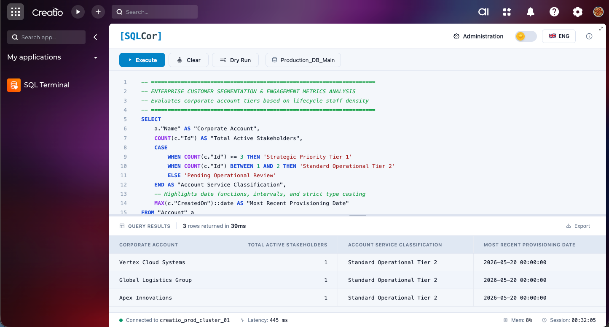
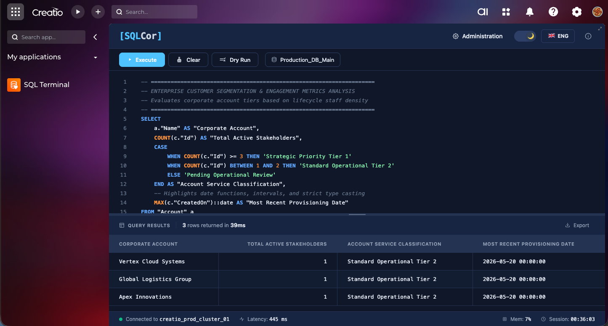

---

## Header

The header runs across the top. The right side contains four controls.


### Administration button

| Property | Detail |
|----------|--------|
| **Visible to** | System administrators only |
| **Hidden from** | Regular users — this button does not appear for non-admins |
| **What it does** | Switches to the Administration panel |
| **Editor preserved?** | Yes — your current query stays in the editor when you switch back |

---

### Theme toggle

| Property | Detail |
|----------|--------|
| **Options** | Dark theme (default) / Light theme |
| **Applies to** | Entire SQL Cor interface |
| **Saved** | In browser `localStorage` — persists after refresh and new sessions |
| **Per device** | Yes — each browser/device has its own saved preference |


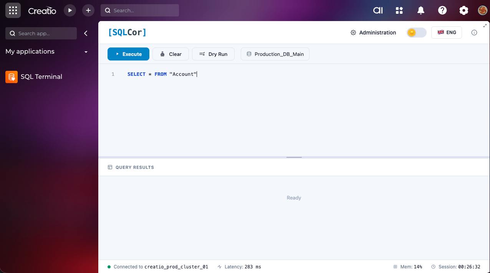
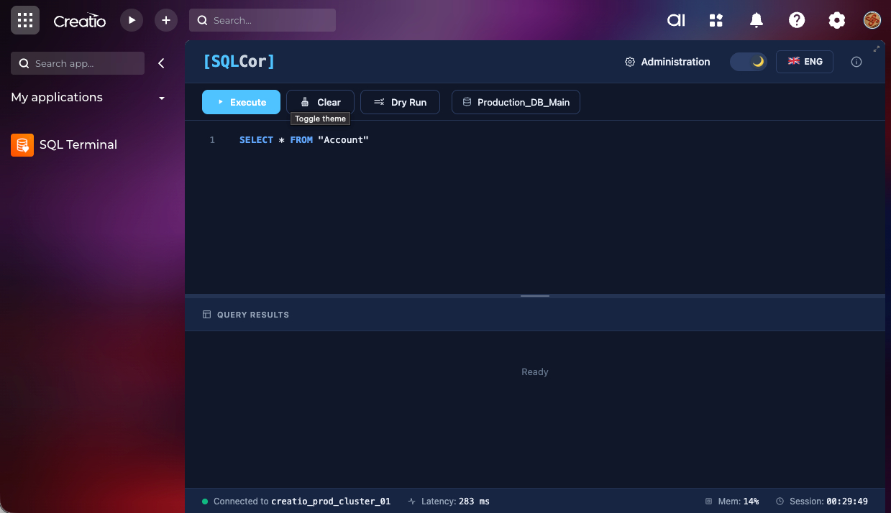


---

### Language button

| Property | Detail |
|----------|--------|
| **Options** | Ukrainian / English |
| **What changes** | All UI labels, button text, hints, and messages |
| **What does NOT change** | Database content, SQL keywords, DB engine error messages |
| **Applies immediately** | Yes — no page reload needed |
| **Saved** | In browser `localStorage` |

---

### About button

| Property | Detail |
|----------|--------|
| **What it opens** | ABOUT modal window |
| **Contents** | Package version number, key features list (Secure access · Audit trail · Role-based), contact info |
| **How to close** | Click outside the modal, or press `Escape` |

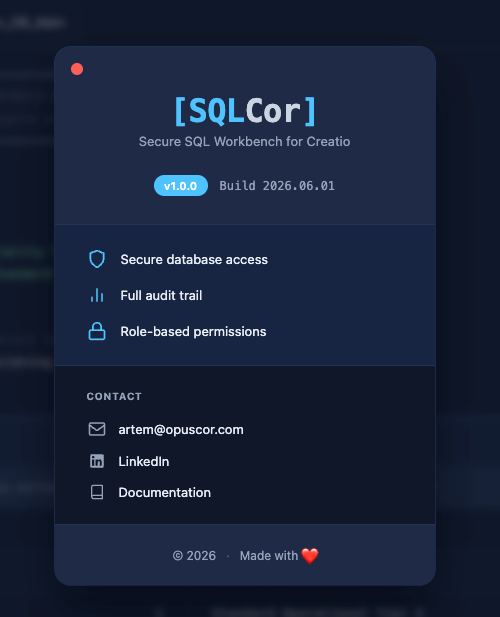
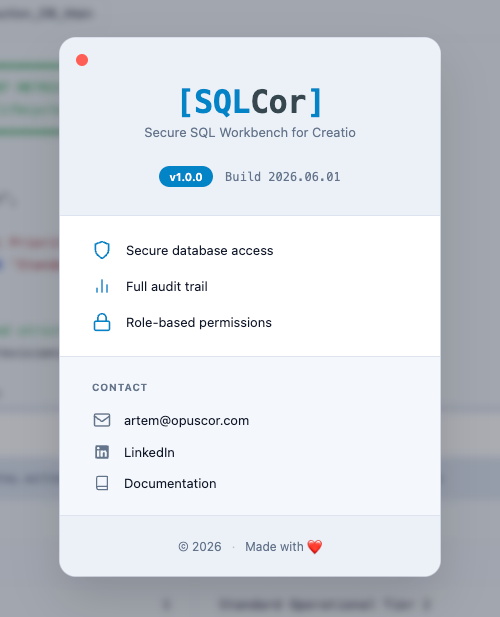


---

## Toolbar

The toolbar sits below the header and contains four controls.


### Execute button

**Purpose:** Sends your SQL to the backend and runs it.

**Keyboard shortcuts:** `F5` · `Ctrl + Enter` · `Cmd + Enter`

**What happens when you click Execute:**

```
1. SQL is sent to the backend
2. Backend checks your access level
3. Backend checks blacklist
4. Backend checks operation type vs your access level
5. If all checks pass → query runs against the database
6. Results appear in the Results panel
7. Footer latency updates
```

**Special case — DELETE without Dry Run:**
If your query contains `DELETE` and Dry Run is OFF, a confirmation dialog appears
before execution. See [Destructive Operation Dialog](#destructive-operation-dialog).

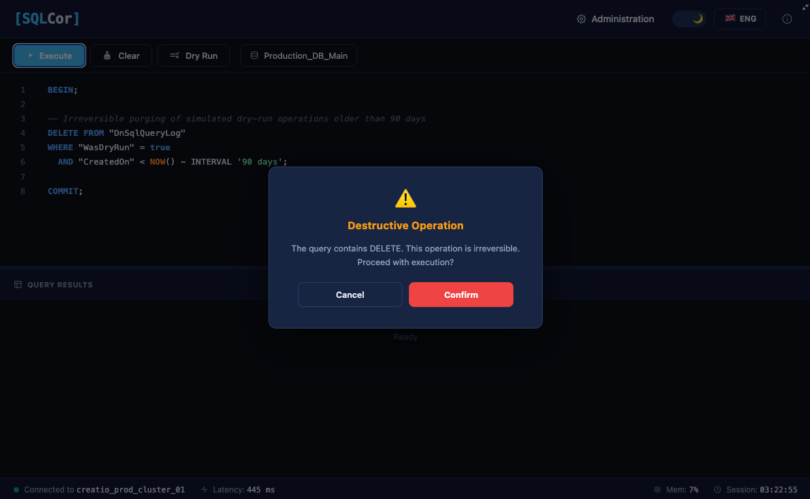
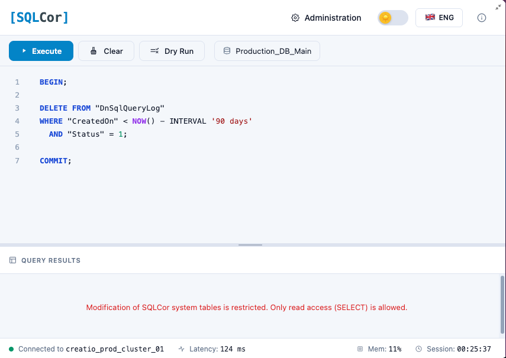

**If your query is blocked:**
An error message appears in the Results panel explaining why (blacklist match,
access level, etc.).

---

### Clear button

**Purpose:** Empties the editor and returns focus to it.

| What is cleared | What is NOT cleared |
|----------------|---------------------|
| Editor content | Results panel |
| Editor undo history | Footer statistics |
| | Smart Hints |
| | `localStorage` autosave (may restore on refresh) |

---

### Dry Run toggle

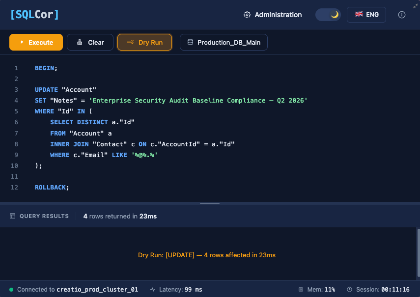
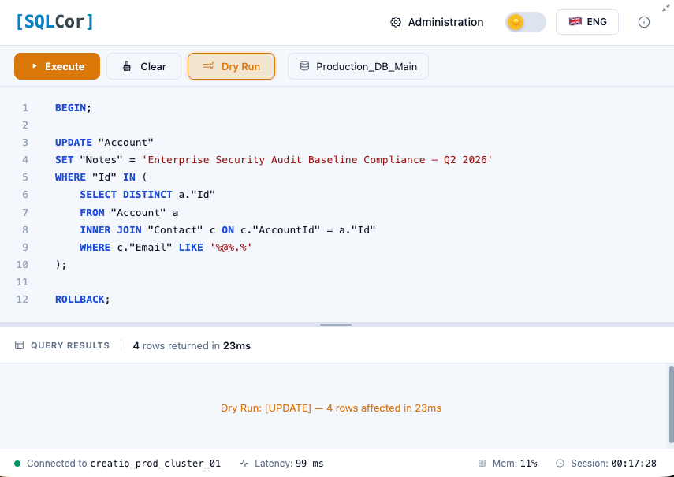

**Purpose:** Enables safe testing mode — runs your query in a transaction that
is always rolled back.

**Visual:** Button appears highlighted/active when Dry Run is ON.

**How Dry Run works technically:**

```
1. Backend opens a database transaction
2. Your query executes INSIDE the transaction (for real)
3. Backend collects results (row count, errors, constraint violations)
4. Transaction is ALWAYS ROLLED BACK — no changes committed
5. You see accurate results as if the query ran permanently
```

**What this means:**

| Aspect | What happens in Dry Run |
|--------|------------------------|
| Row count | Accurate — shows actual rows that would be affected |
| Error detection | Real — constraint violations, syntax errors surface correctly |
| Data changes | None — everything is rolled back |
| Database triggers | May fire (this is normal for transaction-based testing) |
| SELECT queries | Same result as without Dry Run — no difference |

**When to use Dry Run:**
- Before any `UPDATE` or `DELETE` that affects multiple rows
- When testing a complex `INSERT` for constraint violations
- When you're uncertain about your `WHERE` clause scope
- Any time you want to know "how many rows would this affect?"

> [!tip] Best Practice for DELETE
> Always run with Dry Run first. Check the row count. Only then disable Dry Run and execute for real.

> [!note] Triggers Still Fire
> Database triggers may fire during Dry Run (this is expected — the query runs inside a real transaction). The trigger effects are rolled back along with everything else.

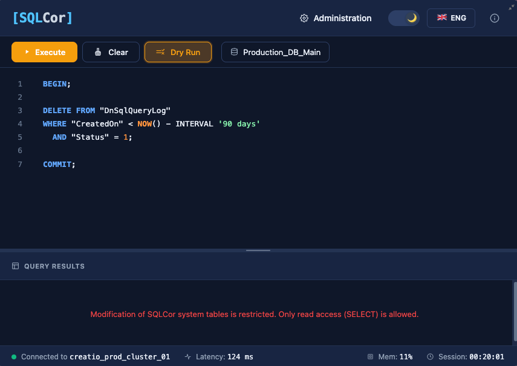
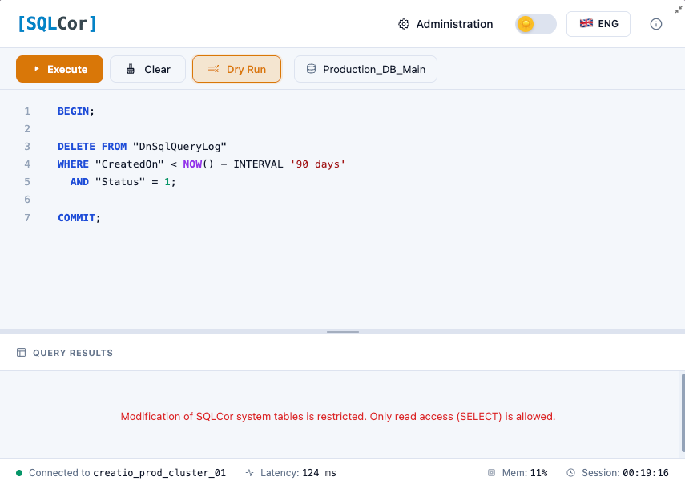


---

### Database indicator

**Purpose:** Shows the name of the database SQL Cor is connected to.

**Example:** `Production_DB_Main`

**Is it clickable?** No — information only. You cannot switch databases.

**Why it matters:** In organizations with multiple Creatio environments (production,
staging, test), this confirms which environment you're currently querying.

---

## Editor

The editor is where you write SQL. It has several built-in features.

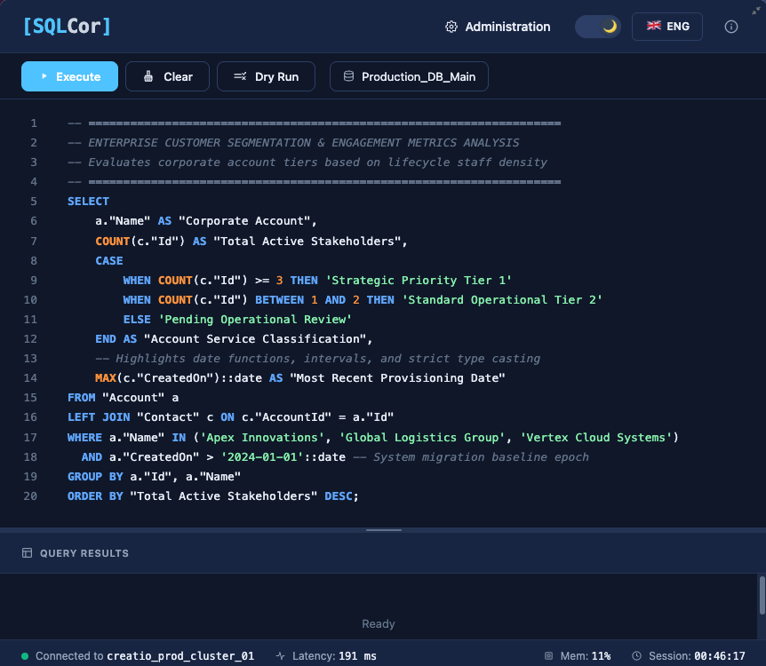
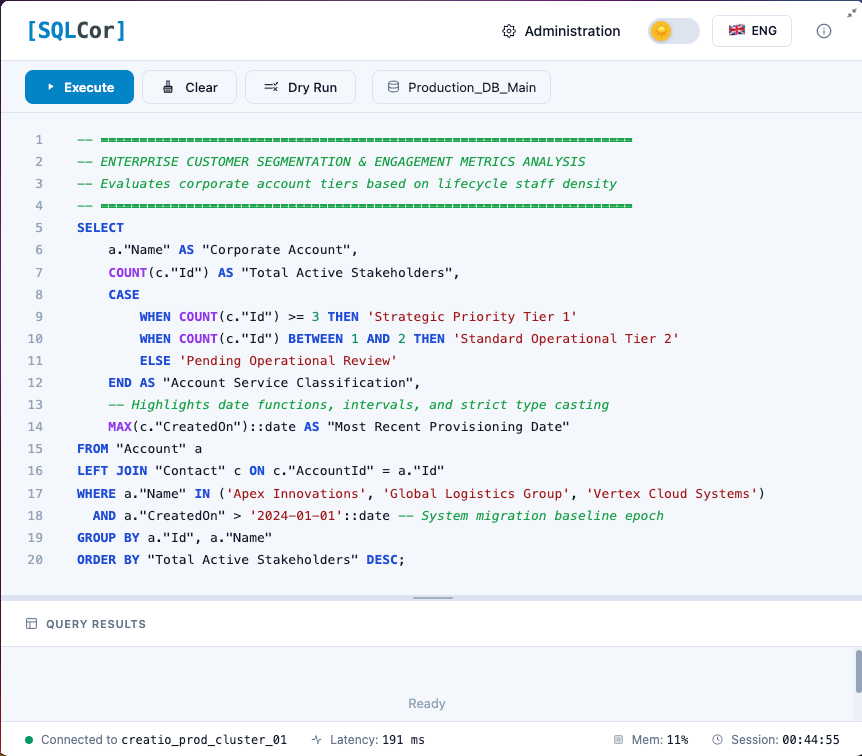

### Syntax highlighting

| Element | Color (dark theme) |
|---------|-------------------|
| SQL keywords (`SELECT`, `FROM`, `WHERE`...) | Cyan / Blue |
| String literals (`'value'`) | Orange / Yellow |
| Comments (`--` or `/* */`) | Gray |
| Numbers | Green |
| Table / column names | White |

### Line numbers

Displayed automatically on the left. Updates as you type.

### Tab indentation

Pressing `Tab` inserts indentation — useful for formatting multi-line queries.

### Autosave

The editor saves your current query to `localStorage` automatically as you type.
If you refresh the page or navigate away and return, your last query is restored.

### Keyboard shortcuts

| Shortcut | Action |
|----------|--------|
| `F5` | Execute query |
| `Ctrl + Enter` / `Cmd + Enter` | Execute query |
| `Tab` | Insert indentation |
| `Ctrl + A` / `Cmd + A` | Select all text |
| `Ctrl + Z` / `Cmd + Z` | Undo |
| `Ctrl + Y` / `Cmd + Y` | Redo |
| `Ctrl + /` / `Cmd + /` | Comment / uncomment line |

### PostgreSQL identifier quoting — important

Creatio uses Pascal-case table names (`Contact`, `Account`). PostgreSQL lowercases
unquoted identifiers. Always use double quotes:

```sql
-- WRONG (PostgreSQL sees "contact" — doesn't exist):
SELECT * FROM Contact;

-- CORRECT:
SELECT * FROM "Contact";
```

SQL Cor's Smart Hints will remind you automatically if this error occurs.

### ReadOnly user restriction — multi-statement queries

If your access level is **ReadOnly**, queries containing a semicolon separating
multiple statements are **rejected entirely** to prevent injection-style escalation:

```sql
-- Rejected for ReadOnly users:
SELECT 1; DROP TABLE "Contact";

-- Allowed — single statement only:
SELECT * FROM "Contact" LIMIT 10;
```

---

## Smart Hints

Smart Hints is a **yellow information bar** that appears above the Results panel
when SQL Cor detects a specific error pattern or query issue. It suggests a fix
and offers to correct your query automatically.


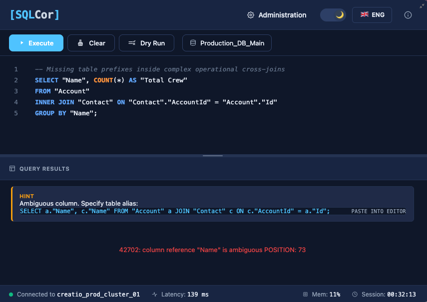
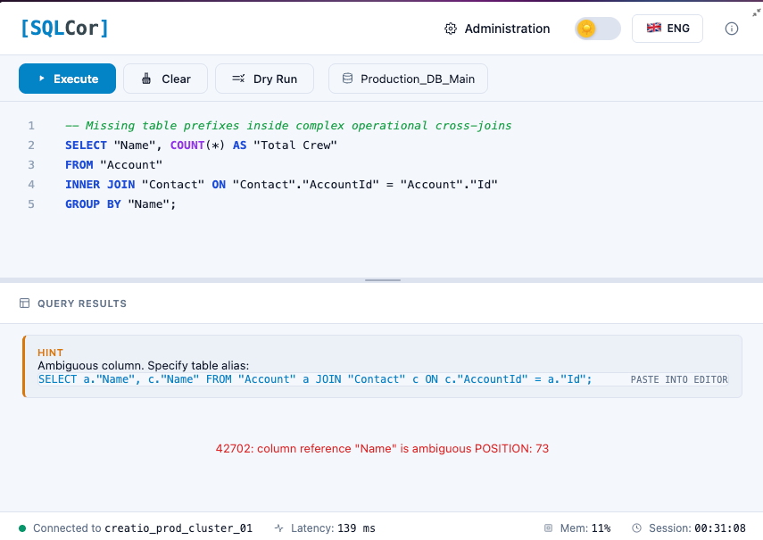

### How Smart Hints works

Smart Hints appears **automatically after query execution** — you don't activate
it manually. It analyzes the error or query and shows a relevant tip.

Each hint may include an **INSERT INTO EDITOR** button that replaces your current
query with a corrected template.

### Hint 1 — Case-sensitive table name (PostgreSQL)

**Triggered when:** Error "relation X does not exist" and table written without quotes.

**Message:** *"PostgreSQL is case-sensitive. Try wrapping the table name in double
quotes: `"Account"`"*

**INSERT INTO EDITOR:** Rewrites query with quoted table name.

```sql
-- Before:  SELECT * FROM Account;
-- After:   SELECT * FROM "Account";
```

---

### Hint 2 — TOP vs LIMIT syntax

**Triggered when:** Query contains `SELECT TOP N` (MSSQL syntax).

**Message:** *"On PostgreSQL, use LIMIT instead of TOP. Example: SELECT * FROM
"Table" LIMIT 10"*

**INSERT INTO EDITOR:** Converts `SELECT TOP N` to `SELECT ... LIMIT N`.

```sql
-- Before:  SELECT TOP 10 * FROM "Contact";
-- After:   SELECT * FROM "Contact" LIMIT 10;
```

---

### Hint 3 — Permission error

**Triggered when:** Query fails with a database-level "permission denied".

**Message:** *"Permission error. Check your access level in Administration →
Access Control."*

**No INSERT INTO EDITOR** — this is informational only.

**What to do:** Contact your administrator to request a higher access level.

---

### Hint 4 — Ambiguous column reference

**Triggered when:** Error "column reference X is ambiguous" (typically in JOINs).

**Message:** *"Column is ambiguous. Add the table alias prefix: `t."ColumnName"`"*

**INSERT INTO EDITOR:** Provides a corrected query template with table aliases.

```sql
-- Before:  SELECT "Name" FROM "Contact" JOIN "Account" ON ...
-- After:   SELECT c."Name" FROM "Contact" c JOIN "Account" a ON ...
```

---

### Dismissing Smart Hints

Smart Hints disappears when:
- You execute a new successful query
- You clear the editor

---

## Results panel

The Results panel shows your query output.


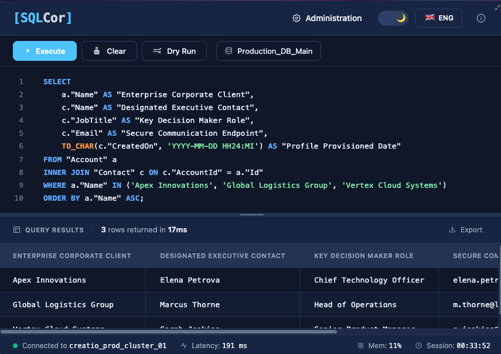
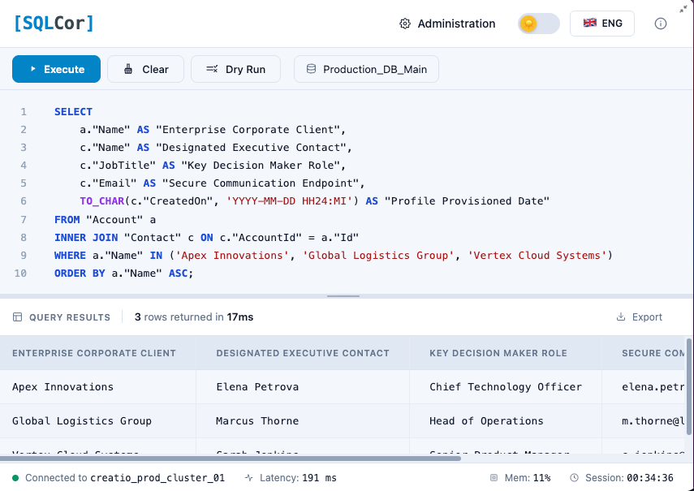

### Data table (SELECT queries)

| Data type | Display |
|-----------|---------|
| `NULL` values | *Italic* `NULL` text |
| `Boolean TRUE` | Green highlight |
| `Boolean FALSE` | Red highlight |
| Numbers | Right-aligned |
| Text | Left-aligned |
| Long text | Truncated `...` (hover for full value) |

**Row limit notice:**
If results are truncated by the Max Rows setting, you see:
> *"Results limited to X rows. Use LIMIT in your query for precise control."*

### Meta information

Displayed below the table:
- SELECT: *"X rows returned in Y ms"*
- DML: *"X rows changed in Y ms"*

### Export button

| Property | Detail |
|----------|--------|
| **File format** | CSV |
| **File name** | Auto-generated with timestamp: `sqlcor_export_YYYYMMDD_HHMMSS.csv` |
| **Contents** | All visible rows + column headers |
| **Available when** | After a successful SELECT that returned rows |
| **NOT available for** | DML results, DDL results, empty result sets, error states |
| **Limitation** | Exports only rows shown (respects Max Rows limit) |


---

## Footer (Status bar)

The footer runs across the bottom of the page with four real-time indicators.


### Status indicator

| Indicator | State | Meaning |
|-----------|-------|---------|
| 🟢 Green | Connected | Database reachable |
| 🔴 Red | Disconnected | Database unavailable |
| 🟡 Yellow | Checking | Connection being tested |

If red: try Check Connection in Admin → System Settings, or contact your admin.

### Latency (ms)

Time of the last executed query in milliseconds. Updates after each execution.

**Typical ranges:**
- 50–300ms: Normal
- 300–2000ms: Complex query or moderate DB load
- 2000ms+: Heavy query — consider optimizing or contacting admin

### Memory (Mem %)

JavaScript heap memory usage in the browser, as a percentage.

| Range | Meaning |
|-------|---------|
| Below 60% | Normal |
| 60–80% | Browser working hard — consider refreshing if slow |
| Above 80% | High memory — refresh the page |

This reflects browser memory only, not server or database memory.

### Session timer

Time elapsed since you opened SQL Terminal this session.
Format: `HH:MM:SS`. Resets on page refresh, tab close, or logout.

---

## Dialogs and popups

### Destructive Operation dialog


**Appears when:**
- Your query contains `DELETE`
- Dry Run is **OFF**

**Purpose:** Mandatory confirmation before permanent data deletion.

| Button | Action |
|--------|--------|
| **Confirm** | Executes the DELETE query |
| **Cancel** | Closes dialog — query is NOT executed, editor stays as-is |

**Best practice:** Always use Dry Run first to verify row count, then disable
Dry Run and execute with Confirm.

---

## Access levels — rules and restrictions

Your administrator assigns your access level. Here's what each level allows.

### ReadOnly

| Feature | Behavior |
|---------|----------|
| `SELECT` | ✅ Allowed |
| `INSERT` / `UPDATE` / `DELETE` | ❌ Blocked |
| `CREATE` / `ALTER` / `DROP` | ❌ Blocked |
| Auto-LIMIT injection | ✅ Applied if you don't write LIMIT |
| Multi-statement queries (`;`) | ❌ Rejected entirely |
| Dry Run | ✅ Available (though no practical effect on SELECT) |

**Error when trying DML:**
> *"Access denied. Your access level is Read-only. This operation requires DML access."*

---

### DML

| Feature | Behavior |
|---------|----------|
| `SELECT` | ✅ Allowed |
| `INSERT` / `UPDATE` / `DELETE` | ✅ Allowed |
| `CREATE` / `ALTER` / `DROP` | ❌ Blocked |
| Destructive Operation dialog | ✅ Shown for `DELETE` without Dry Run |
| System table protection | ✅ Cannot modify `DnSql*` tables |
| Blacklist rules | ✅ Enforced |

---

### DDL

| Feature | Behavior |
|---------|----------|
| `SELECT` / DML | ✅ Allowed |
| `CREATE` / `ALTER` / `DROP` | ✅ Allowed on non-system tables |
| Hardcoded blocked operations | ❌ Still blocked (no exceptions) |
| System table protection | ✅ Cannot modify `DnSql*` tables |
| Blacklist rules | ✅ Enforced |

---

## Security rules

### Hardcoded blocks — always blocked for everyone

These operations cannot be executed by anyone, at any access level, under any
configuration:

> [!danger] Always Blocked — No Exceptions
> The following operations are hardcoded in the backend. No administrator can disable them. They protect against catastrophic or malicious database operations.

| Blocked operation | Reason |
|-------------------|--------|
| `xp_cmdshell` | SQL Server shell execution |
| `pg_read_file` | Reading files from the server filesystem |
| `pg_sleep` | Intentional DB process blocking |
| `pg_terminate_backend` | Killing database connections |
| `OPENROWSET` | External data source access |
| `DROP DATABASE` | Catastrophic data loss |
| `DnSql*` table modifications | Protecting SQL Cor's own config tables |

**Error when hitting a hardcoded block:**
> *"This query is blocked by the system. Reason: [description]"*

### Literal masking (invisible to you, but important)

Before checking your query against blacklist patterns, the backend **masks all
content inside single quotes** (string literals). This means:

```sql
-- This query is SAFE — the word DROP is inside a string literal
-- SQL Cor's parser correctly identifies it as just a text value
SELECT * FROM "Contact" WHERE "Notes" = 'DROP TABLE example';
```

You don't need to do anything special — this protection is automatic.

### Audit logging

> [!note] Every Query is Logged
> Every query you run through SQL Cor is recorded in the audit log — including successful queries, failed queries, blocked attempts, and Dry Run executions. Administrators can review this log at any time.

**The log records:** who ran it · when · full query text · result status · row count / error · whether it was a Dry Run

### Maintenance Mode

If maintenance mode is active, you'll see a custom message from your administrator
when trying to execute:

> *"[Administrator's message, e.g.: 'Database update in progress until 14:00']"*

**What to do:** Wait and try again later. Query execution is disabled for all
non-admin users during maintenance mode.

---

## Common tasks

### Run a basic SELECT

```sql
SELECT "Name", "Email", "Phone"
FROM "Contact"
WHERE "IsActive" = true
LIMIT 20;
```

### Safely test a DELETE

1. Turn ON Dry Run ( button highlights)
2. Write your DELETE query
3. Execute → check row count in results
4. If count is correct: turn OFF Dry Run → execute again
5. Confirm in the Destructive Operation dialog

### Find recently created records

```sql
SELECT "Name", "CreatedOn"
FROM "Contact"
WHERE "CreatedOn" > NOW() - INTERVAL '7 days'
ORDER BY "CreatedOn" DESC
LIMIT 50;
```

### Export results to CSV

1. Run a SELECT query
2. Click **Export** in the results panel
3. CSV file downloads automatically

### Look up table column names

```sql
SELECT column_name, data_type, is_nullable
FROM information_schema.columns
WHERE table_name = 'Contact'
  AND table_schema = 'public'
ORDER BY ordinal_position;
```

### Find your access level

```sql
SELECT "AccessLevel", "ValidUntil", "Comment"
FROM "DnSqlAccessRule"
WHERE "UserId" = (
    SELECT "Id" FROM "SysAdminUnit"
    WHERE "Name" = 'your_login_here'
);
```

### JOIN two tables

```sql
SELECT
    c."Name" AS "Contact",
    a."Name" AS "Account"
FROM "Contact" c
JOIN "Account" a ON a."Id" = c."AccountId"
LIMIT 20;
```

---

## Getting help

| Need | Where to go |
|------|-------------|
| Something doesn't work | [Troubleshooting](/v1.0/troubleshooting/) |
| Need higher access level | Contact your SQL Cor administrator |
| Found a bug | GitHub Issues |
| Feature request | GitHub Issues |
| Consulting / implementation | DM Artem on LinkedIn |

---

*SQL Cor — Secure SQL Workbench for Creatio. Free and open source. License: MIT.*
